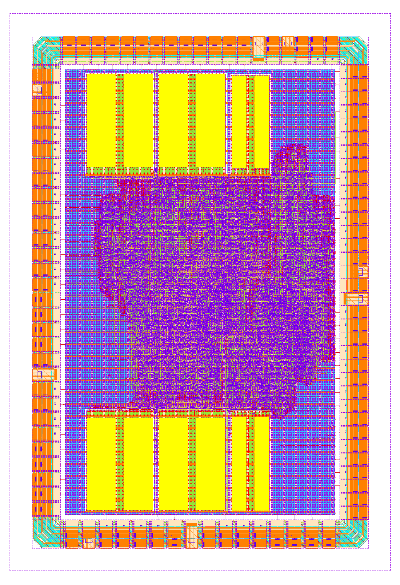

# cdriscv-32s-20 — full-chip level

Chip top `rtl/chip/cdriscv_32s_20_chip.sv` wraps `cdriscv_32s_20_subsys` in an
IHP SG13G2 IO pad ring (`sg13g2_io` library) and is hardened with LibreLane 3's
`Chip` flow (`flow/config_chip.json`, `flow/run_chip.sh`). Everything below is
generated/checked by `scripts/gen_padring.py`, which asserts the subsystem port
list from the RTL and the pad geometry from the PDK LEF before emitting
anything.

**Status: hardened to GDS and timing-closed** (`flow/runs/chip1`,
2026-09-03/04) — see the results section below for the gate table, the two
deliberately deferred items (seal ring, density fill) and the two checks
still open (KLayout DRC re-run, magic overlap classification).

*`cdriscv_32s_20_chip` as streamed out by run `chip1` — 2400 × 3500 µm on
IHP SG13G2. The orange perimeter is the 99-pad `sg13g2_io` ring, the yellow
blocks are the six TCM SRAM macros (I-TCM south, D-TCM north), the purple
field is the subsystem logic. The gap between ring and die edge is the
140 µm `PAD_EDGE_SPACING` reserved for the deferred seal ring.*

## Die

| | |
|---|---|
| Die | **2400 × 3500 µm** (8.40 mm²) |
| Ring depth per edge | 140 µm sealring allowance (`PAD_EDGE_SPACING`) + 180 µm pad depth |
| Core area | [350, 350, 2050, 3150] (1700 × 2800 µm) |
| Pads | 99 (83 signal + 16 supply) + 4 × `sg13g2_Corner` |
| Pad cell pitch | 80 µm wide × 180 µm deep (from `sg13g2_io.lef`), ring gaps filled with `sg13g2_Filler*` |
| TCM macros | 6 × RM_IHPSG13 SRAM, same I-TCM-south / D-TCM-north arrangement as the subsys floorplan, relocated into the new core |

Side occupancy (pad count / spacing between pads): south 16 / 28 µm,
east 34 / 4 µm, north 19 / 12 µm, west 30 / 14 µm. The east side is the
tightest; one more pad there would force a taller die.

## Pinout plan

- **South** — system clock domain entry (`clk_i`, `rst_ni`, `fetch_enable_i`),
  the JTAG group (`tck/tms/tdi/trst_n` + the single tri-state `tdo` pad), and
  the safety status outputs (`err_pin_o`, `reset_req_o`, `fault_any_o`,
  `core_sleep_o`).
- **East** — `fault_ext_i[15:0]` and `irq_i[13:0]` (digital board face).
- **North** — DAC bundle at the west end (adjacent to the analog face) and the
  reference-clock domain (`ref_clk_i`, `ref_rst_ni`) at the east end.
- **West** — the analog companion die face: ADC interface, `atest_*`,
  `ana_flag_i`. The DAC bundle overflows onto the adjacent north-west corner
  because 39 AMS signals + 4 supplies do not fit a 33-slot side; growing the
  die to fit them (~+1 mm of height) was not worth the area.

TDO is **one pad**: `sg13g2_IOPadTriOut4mA`, `c2p` ⇐ `tdo_o`, active-high
`c2p_en` ⇐ `tdo_oe_o` (the model is `assign pad = c2p_en ? c2p : 1'bz;`), so
TDO floats except while the TAP drives it, per IEEE 1149.1.

## Power pads

One quad per side (16 total): `sg13g2_IOPadVdd`/`Vss` (core 1.2 V) and
`sg13g2_IOPadIOVdd`/`IOVss` (3.3 V pad ring) — at least one pair per side of
each domain, per the IO library's ring-abutment scheme. Supply distribution is
by ring abutment (`connect_by_abutment` in `OpenROAD.PadRing`); the pad
instances exist in the netlist as `(* keep *)` shells with no logic terminals.
IR-drop-driven addition of further pairs is a post-layout decision.

## What is absent, and why

- **ADC/analog**: this chip contains **no ADC**. All AMS interface signals
  (`adc_*`, `dac_*`, `atest_*`, `ana_flag_*`) go to pads for the external
  analog companion die on the west face.
- **Expansion APB** (`ext_p*`, 78 wires): unused on this die. Inputs tied
  benign (`ext_pready_i = 1`, `ext_pslverr_i = 0`, `ext_prdata_i = 0`);
  outputs unconnected.
- **Retire trace** (`retire_*`, 66 wires): verification-only; unconnected.
- **`boot_addr_i`**: tied to `32'h0000_0000` inside the chip top, mirroring
  `flow/cdriscv_32s_20_subsys_hard.sv` (finding V18) — the chip *is* the hard
  top, so `cdriscv_32s_20_subsys` is instantiated directly.
- **Bondpads**: the PDK's LibreLane IO config names `bondpad_70x70`, but no
  such macro exists in `sg13g2_io.lef`/`.gds`; `PAD_BONDPAD_NAME` is nulled in
  `config_chip.json` (placing it would abort the pad step). Assembly-level
  decision, later.

## Hardening result (run `chip1`, 2026-09-03/04)

Two bounded probes preceded the harden: `chipfp1` (synthesis → floorplan →
`OpenROAD.PadRing`) proved the ring places, and `chipfp2` (through tap/endcap
insertion) proved the full geometry — 370 IO-library cells placed FIXED, die
exactly as computed. What neither could prove is that the chip's port
terminals land *on* the pads: the first full run died at global placement
with GPL-0326 because `PAD_PLACE_IO_TERMINALS` had never been set
(`flow/pad_cfg_chip.tcl` now sets it; findings
[§19](verification_findings_20.md)).

The full harden then closed. Timing knobs came from the `probe2` experiment
on the subsystem — `sg13g2_buf_4` repair buffers plus larger resizer setup
margins took the fetch critical path from −0.719 ns to −0.059 ns — and
`chip1` runs buf_4 with 0.35 ns margins (`flow/config_chip.json`).

| Gate | Result |
|---|---|
| **Setup, slow 1.08 V/125 °C** | **+0.373 ns**, TNS 0, 0 violations |
| Setup, typ / fast | +15.35 / +23.91 ns |
| Hold, all corners | clean — worst +0.139 ns (fast), TNS 0 |
| Detailed routing | **0 DRC violations** |
| Antenna (OpenROAD + KLayout) | **0** |
| GDS XOR (Magic vs KLayout) | **0 differences** |
| **LVS** (netgen) | **circuits match uniquely** — **161 742 devices, 86 330 nets**, pad ring included |

(All numbers from `flow/runs/chip1/final/metrics.json` and
`72-netgen-lvs/reports/lvs.netgen.rpt`.)

### Deferred, deliberately, with evidence

* **Seal ring.** The PDK's sealring PCell emits INT32_MIN edge-arm
  coordinates on all 20 of its layers, for **every** size tried — including
  the PDK docstring's own example (reproduce:
  `klayout -n sg13g2 -zz -r $PDK/libs.tech/klayout/tech/scripts/sealring.py
  -rd width=1300.0 -rd height=1300.0 -rd output=x.gds`). The corrupt
  geometry then crashes the density filler
  (`dbPolygonGenerators.cc … m_open.empty()`, log in
  `chip1/66-klayout-filler/`). A second, upstream-reportable defect:
  LibreLane's `KLayout.SealRing` with the script variable nulled *runs*
  with a `None` path instead of skipping (`chip1/67-klayout-sealring/`).
  The die reserves the full 140 µm allowance (`PAD_EDGE_SPACING`), so a
  fixed ring drops in later **without a floorplan change**. The skip is
  encoded in `flow/run_chip.sh` with this reasoning attached.
* **Density fill.** The PDK filler OOMs (>13 GB) on the 8.4 mm² die even
  one fill area at a time; deferred like the ring. For scale: the Classic
  subsystem flow never ran metal fill either, so this is not a capability
  the smaller runs had and this one lost.

### Still open — evidence, not verdicts

* **KLayout signoff DRC** is re-running on the corrected (no-sealring)
  GDS. The first pass consumed the flow's last completed state — the
  sealring-corrupted GDS from step 65 (`68-klayout-drc/state_in.json`
  names it) — and its **60 errors trace entirely to that corrupt
  geometry**: 5 `Seal.n` plus off-grid/angle/via artifacts at the
  staircase coordinates. That pass is an invalid check, not a verdict;
  findings [§19](verification_findings_20.md) carries the stale-state
  lesson.
* **956 magic "illegal overlap" messages**, all of the form
  `obsm* vs metal* types do not connect` (950 on metal7, 6 on metal3):
  the IO cells' LEF **obstruction** layers against routed metal — an
  abstraction artifact, not drawn shorts, and LVS matched uniquely
  through the same magic extraction. Classification is pending a
  decision: exclude the IO cells from the check the way the SRAMs are,
  or waive with analysis.

## Pinout table

Pad numbering counter-clockwise from the south-west corner; per-side positions
ascend west→east (S, N) and south→north (E, W). List order in
`PAD_SOUTH/EAST/NORTH/WEST` *is* the placement data — `OpenROAD.PadRing`
spreads each side evenly.

<!-- BEGIN GENERATED PINOUT -->
| pad | pos | chip net | IO cell | drive |
|---|---|---|---|---|
| 1 | S01 | `(pad ring)` | `sg13g2_IOPadIOVss` | - |
| 2 | S02 | `(pad ring)` | `sg13g2_IOPadIOVdd` | - |
| 3 | S03 | `tck_i` | `sg13g2_IOPadIn` | - |
| 4 | S04 | `tms_i` | `sg13g2_IOPadIn` | - |
| 5 | S05 | `tdi_i` | `sg13g2_IOPadIn` | - |
| 6 | S06 | `trst_ni` | `sg13g2_IOPadIn` | - |
| 7 | S07 | `tdo_o` | `sg13g2_IOPadTriOut4mA` | 4 mA |
| 8 | S08 | `(pad ring)` | `sg13g2_IOPadVdd` | - |
| 9 | S09 | `(pad ring)` | `sg13g2_IOPadVss` | - |
| 10 | S10 | `clk_i` | `sg13g2_IOPadIn` | - |
| 11 | S11 | `rst_ni` | `sg13g2_IOPadIn` | - |
| 12 | S12 | `fetch_enable_i` | `sg13g2_IOPadIn` | - |
| 13 | S13 | `err_pin_o` | `sg13g2_IOPadOut4mA` | 4 mA |
| 14 | S14 | `reset_req_o` | `sg13g2_IOPadOut4mA` | 4 mA |
| 15 | S15 | `fault_any_o` | `sg13g2_IOPadOut4mA` | 4 mA |
| 16 | S16 | `core_sleep_o` | `sg13g2_IOPadOut4mA` | 4 mA |
| 17 | E01 | `fault_ext_i[0]` | `sg13g2_IOPadIn` | - |
| 18 | E02 | `fault_ext_i[1]` | `sg13g2_IOPadIn` | - |
| 19 | E03 | `fault_ext_i[2]` | `sg13g2_IOPadIn` | - |
| 20 | E04 | `fault_ext_i[3]` | `sg13g2_IOPadIn` | - |
| 21 | E05 | `fault_ext_i[4]` | `sg13g2_IOPadIn` | - |
| 22 | E06 | `fault_ext_i[5]` | `sg13g2_IOPadIn` | - |
| 23 | E07 | `fault_ext_i[6]` | `sg13g2_IOPadIn` | - |
| 24 | E08 | `fault_ext_i[7]` | `sg13g2_IOPadIn` | - |
| 25 | E09 | `fault_ext_i[8]` | `sg13g2_IOPadIn` | - |
| 26 | E10 | `fault_ext_i[9]` | `sg13g2_IOPadIn` | - |
| 27 | E11 | `fault_ext_i[10]` | `sg13g2_IOPadIn` | - |
| 28 | E12 | `fault_ext_i[11]` | `sg13g2_IOPadIn` | - |
| 29 | E13 | `fault_ext_i[12]` | `sg13g2_IOPadIn` | - |
| 30 | E14 | `fault_ext_i[13]` | `sg13g2_IOPadIn` | - |
| 31 | E15 | `fault_ext_i[14]` | `sg13g2_IOPadIn` | - |
| 32 | E16 | `fault_ext_i[15]` | `sg13g2_IOPadIn` | - |
| 33 | E17 | `(pad ring)` | `sg13g2_IOPadVdd` | - |
| 34 | E18 | `(pad ring)` | `sg13g2_IOPadVss` | - |
| 35 | E19 | `(pad ring)` | `sg13g2_IOPadIOVdd` | - |
| 36 | E20 | `(pad ring)` | `sg13g2_IOPadIOVss` | - |
| 37 | E21 | `irq_i[0]` | `sg13g2_IOPadIn` | - |
| 38 | E22 | `irq_i[1]` | `sg13g2_IOPadIn` | - |
| 39 | E23 | `irq_i[2]` | `sg13g2_IOPadIn` | - |
| 40 | E24 | `irq_i[3]` | `sg13g2_IOPadIn` | - |
| 41 | E25 | `irq_i[4]` | `sg13g2_IOPadIn` | - |
| 42 | E26 | `irq_i[5]` | `sg13g2_IOPadIn` | - |
| 43 | E27 | `irq_i[6]` | `sg13g2_IOPadIn` | - |
| 44 | E28 | `irq_i[7]` | `sg13g2_IOPadIn` | - |
| 45 | E29 | `irq_i[8]` | `sg13g2_IOPadIn` | - |
| 46 | E30 | `irq_i[9]` | `sg13g2_IOPadIn` | - |
| 47 | E31 | `irq_i[10]` | `sg13g2_IOPadIn` | - |
| 48 | E32 | `irq_i[11]` | `sg13g2_IOPadIn` | - |
| 49 | E33 | `irq_i[12]` | `sg13g2_IOPadIn` | - |
| 50 | E34 | `irq_i[13]` | `sg13g2_IOPadIn` | - |
| 51 | N01 | `dac_we_o` | `sg13g2_IOPadOut4mA` | 4 mA |
| 52 | N02 | `dac_data_o[0]` | `sg13g2_IOPadOut4mA` | 4 mA |
| 53 | N03 | `dac_data_o[1]` | `sg13g2_IOPadOut4mA` | 4 mA |
| 54 | N04 | `dac_data_o[2]` | `sg13g2_IOPadOut4mA` | 4 mA |
| 55 | N05 | `dac_data_o[3]` | `sg13g2_IOPadOut4mA` | 4 mA |
| 56 | N06 | `dac_data_o[4]` | `sg13g2_IOPadOut4mA` | 4 mA |
| 57 | N07 | `dac_data_o[5]` | `sg13g2_IOPadOut4mA` | 4 mA |
| 58 | N08 | `dac_data_o[6]` | `sg13g2_IOPadOut4mA` | 4 mA |
| 59 | N09 | `dac_data_o[7]` | `sg13g2_IOPadOut4mA` | 4 mA |
| 60 | N10 | `dac_data_o[8]` | `sg13g2_IOPadOut4mA` | 4 mA |
| 61 | N11 | `dac_data_o[9]` | `sg13g2_IOPadOut4mA` | 4 mA |
| 62 | N12 | `dac_data_o[10]` | `sg13g2_IOPadOut4mA` | 4 mA |
| 63 | N13 | `dac_data_o[11]` | `sg13g2_IOPadOut4mA` | 4 mA |
| 64 | N14 | `(pad ring)` | `sg13g2_IOPadVdd` | - |
| 65 | N15 | `(pad ring)` | `sg13g2_IOPadVss` | - |
| 66 | N16 | `(pad ring)` | `sg13g2_IOPadIOVdd` | - |
| 67 | N17 | `(pad ring)` | `sg13g2_IOPadIOVss` | - |
| 68 | N18 | `ref_clk_i` | `sg13g2_IOPadIn` | - |
| 69 | N19 | `ref_rst_ni` | `sg13g2_IOPadIn` | - |
| 70 | W01 | `atest_en_o` | `sg13g2_IOPadOut4mA` | 4 mA |
| 71 | W02 | `atest_sel_o[0]` | `sg13g2_IOPadOut4mA` | 4 mA |
| 72 | W03 | `atest_sel_o[1]` | `sg13g2_IOPadOut4mA` | 4 mA |
| 73 | W04 | `atest_sel_o[2]` | `sg13g2_IOPadOut4mA` | 4 mA |
| 74 | W05 | `atest_sel_o[3]` | `sg13g2_IOPadOut4mA` | 4 mA |
| 75 | W06 | `ana_flag_i[0]` | `sg13g2_IOPadIn` | - |
| 76 | W07 | `ana_flag_i[1]` | `sg13g2_IOPadIn` | - |
| 77 | W08 | `ana_flag_i[2]` | `sg13g2_IOPadIn` | - |
| 78 | W09 | `ana_flag_i[3]` | `sg13g2_IOPadIn` | - |
| 79 | W10 | `(pad ring)` | `sg13g2_IOPadVdd` | - |
| 80 | W11 | `(pad ring)` | `sg13g2_IOPadVss` | - |
| 81 | W12 | `adc_start_o` | `sg13g2_IOPadOut4mA` | 4 mA |
| 82 | W13 | `adc_ch_o[0]` | `sg13g2_IOPadOut4mA` | 4 mA |
| 83 | W14 | `adc_ch_o[1]` | `sg13g2_IOPadOut4mA` | 4 mA |
| 84 | W15 | `adc_ch_o[2]` | `sg13g2_IOPadOut4mA` | 4 mA |
| 85 | W16 | `adc_valid_i` | `sg13g2_IOPadIn` | - |
| 86 | W17 | `adc_data_i[0]` | `sg13g2_IOPadIn` | - |
| 87 | W18 | `adc_data_i[1]` | `sg13g2_IOPadIn` | - |
| 88 | W19 | `adc_data_i[2]` | `sg13g2_IOPadIn` | - |
| 89 | W20 | `adc_data_i[3]` | `sg13g2_IOPadIn` | - |
| 90 | W21 | `adc_data_i[4]` | `sg13g2_IOPadIn` | - |
| 91 | W22 | `adc_data_i[5]` | `sg13g2_IOPadIn` | - |
| 92 | W23 | `adc_data_i[6]` | `sg13g2_IOPadIn` | - |
| 93 | W24 | `adc_data_i[7]` | `sg13g2_IOPadIn` | - |
| 94 | W25 | `adc_data_i[8]` | `sg13g2_IOPadIn` | - |
| 95 | W26 | `adc_data_i[9]` | `sg13g2_IOPadIn` | - |
| 96 | W27 | `adc_data_i[10]` | `sg13g2_IOPadIn` | - |
| 97 | W28 | `adc_data_i[11]` | `sg13g2_IOPadIn` | - |
| 98 | W29 | `(pad ring)` | `sg13g2_IOPadIOVdd` | - |
| 99 | W30 | `(pad ring)` | `sg13g2_IOPadIOVss` | - |
<!-- END GENERATED PINOUT -->
