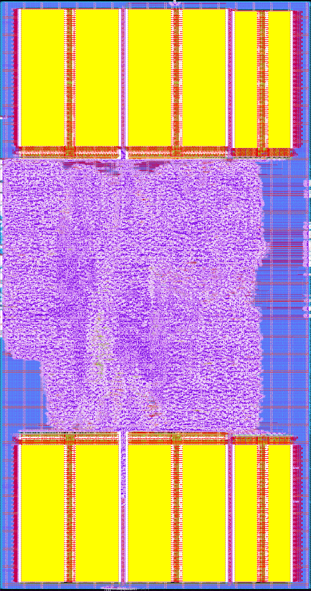

# cdriscv-32s-10 integration manual

> [!NOTE]
> **Inherited from [cdriscv-32s-10](https://github.com/ChipDesign-BV/cdriscv-32s-10)
> and describing variant 1.** Every measured result below was produced on
> variant 1 and has **not** been reproduced for cdriscv-32s-20, whose ISA
> is wider and whose core carries three replaced modules. See
> [variant_status.md](variant_status.md) for what actually holds here.

Everything an SoC team needs to instantiate, constrain, harden, boot
and sign off this subsystem. Companion documents, referenced rather
than repeated: [architecture.md](architecture.md) for how it works,
[register_map.md](register_map.md) for every register bit,
[safety_manual.md](safety_manual.md) for the safety argument and
assumptions of use, [fmeda.md](fmeda.md) for the metrics.

**Status.** Verified to the O1–O9 objectives of
[verification_plan.md](verification_plan.md); may be used in a project.
**Not qualified for safety-critical use** — that needs foundry failure
rates, common-cause analysis and an assessed safety case, per the
FMEDA's handoff checklist. No compliance with any functional safety
standard is claimed.

## 0. Deliverables and integration checklist

### 0.1 What you receive

| Item | Path | Note |
|------|------|------|
| RTL | `rtl/`, read order in `rtl/cdriscv_32s_20_files.f` | SystemVerilog-2017; needs a slang-class front end (see §7.1) |
| Hardening flow | `flow/` | LibreLane 3 config and hardening wrapper, IHP SG13G2 |
| Timing constraints | `verif/sta/cdriscv_32s_20_subsys.sdc` | three-corner, see §8 |
| Verification suite | `verif/`, `Makefile` | 40+ targets; `make lint sim block cosim riscof formal coverage fi gate` |
| Boot example | `tb/sw/start.S` | register zeroing, BIST, safety configuration |
| Evidence | `doc/verification_findings.md` | V0–V52, every number's provenance |

### 0.2 Integration checklist

Work top to bottom; each item names the section that explains it.

- [ ] `boot_addr_i` tied to a **constant** at SoC level — §9.1, not optional
- [ ] `ref_clk_i` driven from an oscillator **physically independent** of `clk_i` — §2, AoU-1
- [ ] Synchroniser inputs constrained false-path / max-delay; flop chains protected from retiming and merging — §2
- [ ] `rst_ni` asynchronous assert, synchronous release preserved; `boot_addr_i` stable while low — §3
- [ ] TCM behavioural arrays replaced by compiled RAM macros, `bist_*` port kept on raw storage — §4
- [ ] `err_pin_o` routed to something outside this subsystem's failure domain — §6.2
- [ ] Safety-controller reactions configured and `CTRL.lock` set during boot — §5
- [ ] Watchdog serviced from exactly one place in the control loop — §5
- [ ] STATUS bit 13 handler implemented (configuration parity) — §6.1
- [ ] Interrupt and fault input widths matched, unused inputs tied low — §1
- [ ] DFT strategy chosen: scan insertion is **not** included — §7.3
- [ ] Timing signed off at the **slow** corner, not just typical — §8.2

## 1. Top level ports (`cdriscv_32s_20_subsys`)

| Port | Dir | Width | Description |
|------|-----|-------|-------------|
| `clk_i` | in | 1 | system clock |
| `rst_ni` | in | 1 | asynchronous active low reset, synchronised internally |
| `ref_clk_i` | in | 1 | independent reference clock for the clock monitor |
| `ref_rst_ni` | in | 1 | reset for the reference domain |
| `boot_addr_i` | in | 32 | reset vector, must be stable during reset |
| `fetch_enable_i` | in | 1 | release the core |
| `irq_i` | in | 14 | SoC interrupt lines, asynchronous, synchronised internally |
| `fault_ext_i` | in | 16 | SoC fault inputs, asynchronous, synchronised internally |
| `err_pin_o` | out | 1 | external error signal, level or toggle protocol |
| `reset_req_o` | out | 1 | high while the internal warm reset is active |
| `fault_any_o` | out | 1 | any fault latched in the safety controller |
| `adc_start_o` | out | 1 | one cycle conversion start |
| `adc_ch_o` | out | 3 | channel for the conversion being started |
| `adc_valid_i` | in | 1 | conversion result valid |
| `adc_data_i` | in | 12 | conversion result |
| `dac_data_o` | out | 12 | trim / DAC output value |
| `dac_we_o` | out | 1 | strobe, one cycle after a write to `DAC` |
| `atest_en_o` | out | 1 | analog test bus enable |
| `atest_sel_o` | out | 4 | analog test bus selection |
| `ana_flag_i` | in | 4 | analog comparator / supervisor flags, asynchronous |
| `ext_p*` | in/out | | APB3 expansion port, peripheral slot 15 |
| `core_sleep_o` | out | 1 | core is in WFI |
| `retire_valid_o`, `retire_pc_o`, `retire_instr_o` | out | 1, 32, 32 | retire trace, for debug and for an external monitor |

## 2. Clocking

* `clk_i` — everything except the measurement part of the clock monitor.
* `ref_clk_i` — the measurement part of the clock monitor only. It must
  come from an oscillator independent of `clk_i` (see AoU-1).

Crossings, all inside `cdriscv_32s_20_clkmon` and the input synchronisers:

| Signal | From | To | Structure |
|--------|------|----|-----------|
| heartbeat toggle | `clk_i` | `ref_clk_i` | 2 flop level synchroniser |
| enable | `clk_i` | `ref_clk_i` | 2 flop, quasi-static |
| `MIN`, `MAX` | `clk_i` | `ref_clk_i` | quasi-static, write while disabled |
| status clear pulse | `clk_i` | `ref_clk_i` | toggle pulse synchroniser |
| fault level | `ref_clk_i` | `clk_i` | 2 flop level synchroniser |
| result toggle + value | `ref_clk_i` | `clk_i` | toggle synchroniser, value captured after |
| `irq_i`, `fault_ext_i`, `ana_flag_i` | async | `clk_i` | 2 flop level synchroniser |

Constrain the synchroniser inputs as false paths (or with a maximum
delay equal to one destination period) and keep the flop chains from
being retimed or merged.

## 3. Reset

`rst_ni` is asynchronously asserted and synchronously released by
`cdriscv_32s_20_rst_sync`. `boot_addr_i` must be stable while `rst_ni` is low.

The warm reset (`WarmRstLen` cycles) restarts the core, the lockstep
pair, the bus and the APB bridge. It does not reset the peripherals, so
the safety status survives a warm reset; software must clear it.

## 4. Memories

`cdriscv_32s_20_tcm` describes its storage behaviourally, as a `logic [38:0]`
array. For an ASIC flow, replace the array with a compiled 39-bit wide
single port RAM (or a 32-bit and a 7-bit instance) with the same timing:
synchronous read with one cycle latency, write in the same cycle as the
address. Keep the `bist_*` port connected to the raw storage; that is
what makes the check bits testable.

## 5. Software boot sequence

1. Run the memory BIST (or configure `MbistAuto`) and check
   `STATUS.fail` for both TCMs. Treat this as mandatory rather than
   optional: besides testing the array it writes every word, and the
   prefetcher will fetch past the end of the program into whatever
   follows it. An unwritten word is an arbitrary code word, and the ECC
   check on it will most likely report an uncorrectable error. If the
   BIST is skipped, the loader must write every TCM word instead.
2. Load or verify the application image in the I-TCM.
3. Zero all architectural registers before enabling the lockstep
   comparison (the example in `tb/sw/start.S` does this) so that the two
   cores start from the same state.
4. Configure the clock monitor `MIN`/`MAX`, then enable it.
5. Configure the safety controller reactions and set `CTRL.lock`.
6. Configure the watchdog `PERIOD`/`WINDOW` and set `CTRL.lock`.
7. Set `mtvec`, enable the interrupts that are needed, enter the control
   loop and service the watchdog from one well defined place in it.

Every configuration group written above is parity-protected from the
moment it is written; the handler that goes with that is §6.1.
Periodic software re-reads (finding V30) are no longer needed for
single-bit detection, but remain the only mechanism that catches a
double-bit upset inside one group, so they stay worthwhile as defence
in depth.

## 6. Safety integration

### 6.1 The one interrupt you must handle

Safety controller `STATUS` bit 13 is **configuration parity**, and it
is deliberately not maskable: a mismatch latches the bit, raises the
safety interrupt and asserts the error pin regardless of `ENABLE`,
`CTRL.enable` and `REACT_*` — because those are exactly the registers
a fault may have corrupted. `CFG_SRC` (0x28) names the offending
group. **Handler**: read `CFG_SRC`, rewrite that group's configuration
(which rebaselines its parity), then W1C bit 13.

Without this mechanism 46.4 % of configuration upsets were latent — a
mechanism silently disabled while the program kept producing correct
answers. With it, zero of 2 600. See findings V29/V37.

### 6.2 The error pin is the escape hatch

`err_pin_o` must reach something **outside this subsystem's failure
domain** — an external supervisor, a safe-state actuator, a system
watchdog. Two modes: level (asserted on fault) and toggle (square wave
while healthy, stops on fault), and toggle is the one that also
survives the subsystem dying entirely, including a stuck-at fault on
the pin itself.

### 6.3 Assumptions of use

The full list is in [safety_manual.md](safety_manual.md). The three
that most often get missed:

* **AoU-1** — `ref_clk_i` from an independent oscillator. A shared PLL
  makes the clock monitor blind to the failure it exists to catch.
* **AoU-2** — the lockstep pair shares clock, reset and supply.
  Common-cause analysis for those is the integrator's, and it is
  outside what fault injection can measure.
* **AoU-3** — memory BIST at every power-up, not merely at production
  test; it is also what initialises the ECC check bits (§5, step 1).

## 7. Implementation

### 7.1 Front end

The RTL uses packages, `always_ff`/`always_comb`, interfaces-free
module ports and SystemVerilog assertions in the benches. Yosys' native
Verilog front end **cannot** parse it — `import cdriscv_32s_20_pkg::*` is
rejected. Use yosys with the slang plugin (`read_slang`), or any
commercial elaborator. In LibreLane set `USE_SLANG: true`; the flow in
`flow/` does.

### 7.2 Parameters

| Parameter | Default | Note |
|-----------|---------|------|
| `Lockstep` | 1 | dual-core lockstep; 0 removes the checker core and its comparator |
| `LockstepDly` | 2 | delay in cycles between main and checker core |
| `ItcmWords`, `DtcmWords` | 4096 | 39-bit words including ECC |
| `RfParity` | 1 | register file parity |
| `MbistAuto` | 0 | run BIST automatically out of reset |
| `WarmRstLen` | — | warm reset duration in cycles |

Set them at instantiation. Note that a gate-level netlist is one
*configuration* — parameters are resolved by synthesis — so a bench
running on the netlist must not re-override them.

### 7.3 DFT

**Scan insertion is not included.** The design has no scan chains, no
test-mode port and no compression. If you need structural test, insert
scan in your own flow after synthesis; the memory BIST covers the
arrays but nothing covers the logic.

Existing test hooks, all software-driven and intended for in-mission
self test rather than manufacturing: `SELFTEST` (forces a lockstep
mismatch, corrupts a TCM code word), `INJECT` (pulses fault bits), and
the March C- memory BIST.

## 8. Physical integration (RTL2GDS)



*Hardened `cdriscv_32s_20_subsys_hard` — 1330 × 2521 µm on IHP SG13G2,
variant 1's signed-off 25 MHz configuration. The two yellow bands are the
TCM macros (I-TCM bottom, D-TCM top): two wide `2048x32` data parts and
one narrower `4096x8` parity part each. The standard-cell logic is the
purple field between them, and the vertical blue strips down both edges
are the power straps.*

Numbers below are from the signed-off main configuration,
`flow/config.json`. The earlier square floorplan
(`flow/config_dense.json`, 1.90 mm, also signed off) is retained as the
more conservative starting point for a different macro set: the
rectangle's advantage comes entirely from these six macros filling two
full-width rows, and it does not transfer to a floorplan whose macros do
not.

### 8.1 The flow

The subsystem hardens with **LibreLane 3** on the IHP SG13G2 PDK. The
flow is roughly 77 steps; the ones that matter to an integrator, with
the tool that runs each and the observed wall-clock on an 8-core
machine:

| Stage | Tool | Time | What it decides |
|---|---|---|---|
| Lint | Verilator | s | four checkers gate before anything else runs |
| Synthesis | Yosys + abc | 2–6 min | the netlist; see the strategy note below |
| Floorplan | OpenROAD | s | die, core, macro placement |
| PDN | OpenROAD | s | power grid and **macro supply hooks** |
| Global placement | OpenROAD | 3 min | converges to an overflow target |
| CTS | OpenROAD | 5 min | the clock tree — and the skew that decides hold |
| Global route | OpenROAD | 1 min | congestion; also where antenna violations appear |
| Diode insertion | OpenROAD | 1 min | **the practical density limit** (§8.2) |
| Detailed route | OpenROAD | 70–85 min | DRC to zero, 8 cores |
| RC extraction | OpenRCX | 1 min | the SPEF that post-route STA reads |
| Post-P&R STA | OpenSTA | 4 min | three-corner setup and hold |
| Streamout | Magic + KLayout | 15 min | GDS, twice, then XOR'd against each other |
| DRC | KLayout | 40 min | signoff deck, 8 threads |
| Extraction | Magic | 15 min | the layout netlist for LVS |
| **LVS** | netgen | **~3 h** | single-threaded; see the note below |

End to end: **roughly 5–6 hours**, of which LVS is more than half.

**Synthesis is not timing-driven by default and should stay that way.**
`SYNTH_STRATEGY` defaults to `AREA 0`, which ignores the clock
constraint entirely — the 20 ns and 40 ns runs produced *byte-identical*
netlists. Setting `DELAY 0` was tried and made things markedly worse:
8.5 % more cells, **49 % more wirelength**, and slow-corner setup fell
from −0.33 ns to −2.78 ns with violating paths going 47 → 1888. abc
optimises against a placement-blind delay model, and on this design the
extra cells cost more in wire than the restructuring gains. All timing
improvement here comes from placement and resizing.

**netgen and magic are single-threaded by construction** — zero
`pthread_create` symbols, no OpenMP or TBB linkage — so the 3-hour LVS
cannot be parallelised by giving it more cores. It is a tool property,
not a configuration. KLayout DRC *is* threaded (`KLAYOUT_DRC_THREADS`)
and OpenROAD's detailed router uses ~8 cores. If LVS runtime becomes a
problem the lever is the PDK's KLayout LVS deck with `run_mode=deep`,
which is hierarchical; that is unexplored here.

### 8.2 Floorplan

Six SRAM macros with 10 µm halos, **banded** — I-TCM along the bottom,
D-TCM along the top — with the standard cells between them. Per TCM:

| part | count | size | holds |
|---|---|---|---|
| `RM_IHPSG13_1P_2048x32_c2_bm_bist` | 2 | 417 × 627 µm | data[31:0], bank select on address bit 11 |
| `RM_IHPSG13_1P_4096x8_c3_bm_bist` | 1 | 237 × 618 µm | check bits[38:32], spans both banks |

Splitting data from check bits is what keeps the array full: a 39-bit
code word in a 64-bit row wastes 25 bits of every row (39 %), while
32 + 8 wastes one bit in eight of the parity part (~2.5 %). The parity
macro is 4096 deep so it needs no bank select — and no `2048x8` part,
which the PDK does not offer.

The signed-off run uses a **1330 × 2521 µm die** (3.353 mm²) at 58.7 %
placement utilisation, 71.7 % once the antenna diodes are placed. Budget
the macros as fixed at **1.34 mm²** for 32 KiB of ECC-protected TCM —
40 % of that die.

**Shape the die around the macro row.** The six macros want two rows the
full width of the die, so the die should be one macro row wide and two
macro rows tall plus the logic. Here that is 1151 µm of macros plus
179 µm of margin. Against a square holding the same logic this is 7.1 %
less area at the same frequency, and it is not geometry: die area is
instance area over utilisation, and the aspect ratio does not appear in
that. What changes is the utilisation the placer can *achieve* — 0.445
on the square against 0.587 here — because a square leaves four corner
regions it fills badly and a rectangle leaves two contiguous bands. The
advantage is a property of *these* macros filling full-width rows and
does not transfer to a floorplan whose macros do not.

Three placement lessons are worth inheriting.

**Band the macros, do not corner them.** Macros at the die corners cost
0.45 ns of clock skew and left hold unclosable. Banded, the worst
skew path measures 0.252 ns of real latency difference.

**Orient them so their pins face the logic.** Every signal pin on these
macros sits on the macro's *bottom* edge. The I-TCM band sits at the
bottom of the die, so with the default `N` orientation its pins point
at the die edge and every path detours around the macro body. Flipping
the I-TCM band to `FS` is worth **0.255 ns** of setup and 4 % of total
wirelength, and costs nothing. The D-TCM at the top is already correct
with `N`.

**The density limit is antenna-diode legalisation, not congestion.**
At 1.82 mm the router sat at 19 % usage with **zero overflow on every
layer** while 29 `ANTENNA_*` cells had nowhere to go, and the run
failed. This design draws ~46 700 antenna cells and each must sit
beside the pin it protects, so what binds is *local* free sites. A
design can be entirely uncongested and still have nowhere to put a
diode.

The floor is now bracketed tightly: **3.312 mm² fails and 3.353 mm²
signs off** — 1.2 % apart in area, 0.008 apart in utilisation. Treat it
as a cliff, not a gradient: the flow either finds sites for ~46 700
diodes or it does not, and a clean congestion report says nothing about
which.

**Frequency is not the lever.** A run at half the clock period changed
standard-cell area by 0.1 %. The clock is not what consumes the area on
this design; the die shape is worth far more.

### 8.3 Power delivery

Each macro needs **three** supply connections — `VDD!`, `VSS!` and the
array supply **`VDDARRAY!`**.

`FP_PDN_MACRO_HOOKS` matches by **instance-name pattern**. This is a
trap worth stating plainly: adding a macro under a new instance name
silently gets it no power at all. That happened here — the parity
macros were named `u_par` while the hooks matched `.*u_bank.*`, and all
six supplies across both parity macros were left floating.

**LVS will not catch this** when the macro is in `LVS_IGNORE_CELLS`,
because those power pins are excluded from the comparison by
construction. `Checker.DisconnectedPins` does catch it, post-route. If
you add a macro, add its hook in the same commit.

### 8.4 Timing

The reference configuration is constrained at **40 ns (25 MHz)** and
closes at all three corners:

| Corner | Setup WS | Hold WS | TNS |
|---|---|---|---|
| slow 1.08 V / 125 °C | +2.698 ns | +0.704 ns | 0 |
| typ 1.20 V / 25 °C | +14.02 ns | +0.36 ns | 0 |
| fast 1.32 V / −40 °C | +20.14 ns | +0.15 ns | 0 |

**Sign off setup at slow, hold at fast, and check typical too.** That
ordering is not pedantry: an early hardening run met its constraint at
the typical corner and missed it **by 9 ns at slow**, where 3 636
register-to-register paths failed. A single-corner analysis had
reported the design "closed". All three corners are in
`verif/sta/cdriscv_32s_20_subsys.sdc` and in `make fmax`.

A run in which setup is not worst at slow, or hold not worst at fast,
has a corner-setup error rather than a surprising result.

**Hold is period-independent.** Shortening the clock tightens setup
only; it does not create hold violations directly, though heavier
repair buffering perturbs the clock tree indirectly. Both clocks are
genuinely asynchronous, so `set_clock_groups -asynchronous` between
`clk` and `ref_clk` is correct rather than convenient.

**On the RC model.** Post-P&R STA reads a real extracted SPEF, but
there is only **one RC corner** — cell delays vary across the three PVT
corners while wire RC does not. For a design with nanoseconds of margin
that is immaterial. For one closing with tens of picoseconds it is not,
and RC-corner variation could plausibly consume the margin.

### 8.5 What each signoff check proves

| Check | Proves | Does not prove |
|---|---|---|
| Detailed-route DRC | the router's own rules are met | foundry rules |
| **KLayout DRC** | the **foundry signoff deck** passes | anything about connectivity |
| GDS XOR | Magic and KLayout agree on the streamout | either is correct |
| **LVS** (netgen) | layout matches **the netlist that produced it** | the netlist is right |
| Antenna | no violating nets after diode insertion | — |
| Disconnected pins | every declared pin is connected | the connection is *correct* |

The LVS row is the one to internalise. LVS compares the extracted
layout against the netlist the flow generated from your RTL. A
consistently wrong netlist matches a consistently wrong layout and LVS
reports success. That is why the TCM's split-macro mapping carries its
own equivalence bench (`make block-tcm`) against the behavioural model:
LVS cannot tell you the parity macro is wired to the *right* bits.

### 8.6 What the flow does not check

**Max slew and max capacitance are not gated.**
`MAX_SLEW_VIOLATION_CORNERS` defaults to `['']` — an empty pattern
matching **no corners** — so the step evaluates nothing and reports
clean while printing the violating corners one line above. Max cap is
the same. Only `TIMING_VIOLATION_CORNERS` defaults to `['*']`.

The reference run has **791 max-slew pins** at the slow corner and 64
max-cap pins, none of which gates the flow. Of the cap violations, 49
are SRAM `A_DOUT` pins loaded to 0.140 pF against a 0.064 pF limit —
2.2× over, meaning the read-path delay is extrapolated past the
characterised Liberty range. That bounds how much the setup margin on
those paths is worth. **Anyone taking this to silicon must resolve it**;
it is not resolved here.

Also absent: no clock-tree review, no signal-integrity or crosstalk
analysis, no ESD or latch-up checks, no packaging or test structures.

### 8.7 Constants

Synthesis emits named constant nets (`one_`/`zero_`) that need tie
cells. Insert them (`insert_tiecells` in OpenROAD, or your flow's
equivalent) — without it every constant in the design is undriven, and
in simulation the reset synchroniser's data input is X and the netlist
is dead on arrival (finding V42).

### 8.8 Reproducing the run

```sh
cd flow
librelane --manual-pdk --pdk-root $PDK_ROOT \
          --run-tag <tag> config.json
```

`--manual-pdk` matters: without it LibreLane tries to *download* a PDK
version and fails. The tools must be on `PATH` — Verilator, Yosys,
OpenROAD, Magic, netgen and KLayout — which is not the container
default.

Placement failures surface within ~11 minutes, so an infeasible
floorplan is cheap to discover; DRC and LVS failures cost hours. When
exploring density, read the post-P&R STA at step 57 rather than waiting
for the flow's own verdict at step 72, which sits *after* the 3-hour
LVS.

## 9. Known constraints

### 9.1 `boot_addr_i` must be tied to a constant

Not a recommendation: `fetch_pc_q` resets to `boot_addr_i`, and a
flip-flop whose reset loads a data value has no standard cell
equivalent. Tie the port to a constant at the SoC level and every flop
maps; drive it from a register and the program counter cannot be
synthesised. Synthesising the subsystem standalone, with `boot_addr_i`
left as a port, leaves 64 flops unmapped — see finding V18.
`flow/cdriscv_32s_20_subsys_hard.sv` is the wrapper that does this for the
reference hardening run.

### 9.2 Performance

Straight-line code retires one instruction per cycle; every taken
branch, jump and load costs extra cycles. At 25 MHz worst case, budget
accordingly — this is a safety-oriented subsystem, not a
throughput-oriented one.

### 9.3 Warm reset does not clear the safety status

By design: the status survives so software can see what happened.
Software must clear it explicitly after reading.

## 10. Verifying your integration

After instantiating, re-run at least:

```sh
make lint          # structural: latches, loops, multiply-driven nets
make sim sw        # boots and runs the smoke program
make cosim         # agreement with the golden model
make safety        # every mechanism fires, and stays quiet when it should
make rdback        # every register reads back what it should
```

If you changed parameters, also `make riscof` (architectural
conformance) and `make fi` (fault injection) — both are sensitive to
configuration in ways directed tests are not.

## 11. Files

| Path | Contents |
|------|----------|
| `rtl/cdriscv_32s_20_files.f` | read order for Verilator, iverilog and yosys |
| `rtl/core/` | core |
| `rtl/safety/` | lockstep, ECC, safety controller, watchdog, clock monitor, BIST |
| `rtl/bus/` | interconnect, TCM, APB bridge |
| `rtl/periph/` | timer, interrupt controller, AMS interface |
| `rtl/common/` | synchronisers, configuration parity, 64-bit counters |
| `flow/` | LibreLane 3 hardening flow and its wrapper |
| `scripts/gen_secded.py` | generates the ECC RTL |
| `scripts/mkimage.py` | builds a 39-bit memory image from a binary |
